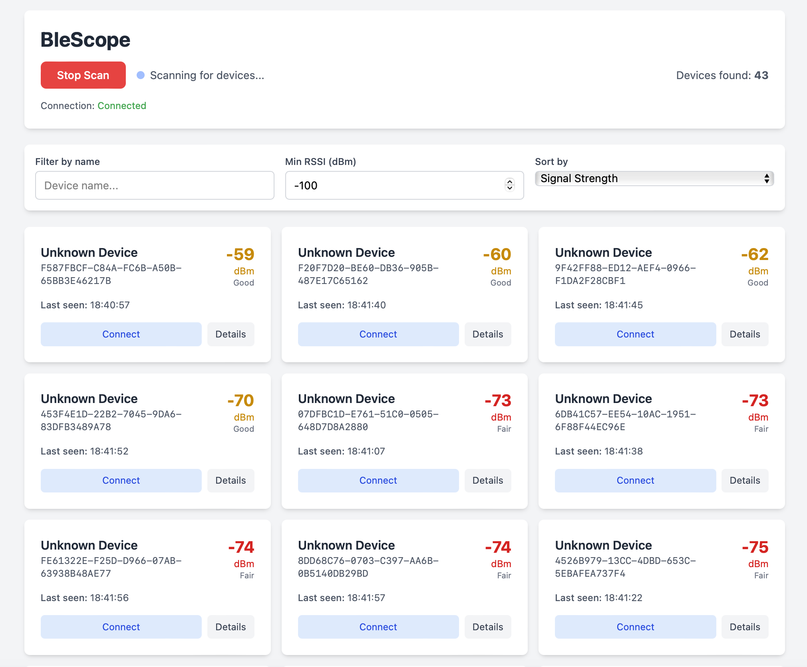

# BleScope - Bluetooth Low Energy Scanner



This file provides guidance to BleScope's architecture, design patterns, and development commands.

## Project Overview

BleScope is a Python-based Bluetooth Low Energy (BLE) scanner application built with FastAPI. Like a telescope for Bluetooth devices, it discovers and tracks BLE devices in the vicinity with real-time updates via WebSockets.

## Development Commands

### Environment Setup
```bash
# Install dependencies using Poetry (required - not pip)
poetry install

# Activate virtual environment
poetry shell
```

### Running the Application
```bash
# Run FastAPI server with hot reload
poetry run python src/main.py

# Alternative - run directly after activating shell
python src/main.py
```

### API Testing Commands
```bash
# Check application health
curl http://localhost:8000/health

# Check scan status
curl http://localhost:8000/api/v1/scan/status

# Start BLE scanning
curl -X POST http://localhost:8000/api/v1/scan/start

# Stop BLE scanning  
curl -X POST http://localhost:8000/api/v1/scan/stop

# Access web UI
open http://localhost:8000

# Access API documentation
open http://localhost:8000/docs
```

## Architecture Overview

BleScope implements hexagonal architecture with domain-driven design and event-driven communication for Bluetooth Low Energy scanning.

### Core Architecture Pattern
- **Hexagonal Architecture**: Ports & adapters pattern with clean separation between business logic and external dependencies
- **Domain-Driven Design**: Rich domain models with pure business logic in the core
- **Event-Driven**: Asynchronous communication through event bus pattern
- **CQRS**: Separate command and query handlers for different use cases
- **Dependency Injection**: All dependencies wired via FastAPI's DI system

### Layer Structure

**Domain Layer** (`src/blescope/scanning/domain/`)
- Core entities: `DiscoveredDevice`, `Scan` 
- Domain events: `ScanStarted`, `ScanStopped`, `DeviceDiscovered`
- Pure Python with no external dependencies

**Application Layer** (`src/blescope/scanning/application/`)
- **Ports**: Abstract interfaces (`BluetoothScanner`, `ScanRepository`, `DeviceRepository`)
- **Services**: `ScanManager` orchestrates scanning operations
- **Commands**: Use case handlers for actions
- **Queries**: Read-only operations (`GetScanStatusQueryHandler`, `GetDiscoveredDevicesQueryHandler`)

**Infrastructure Layer** (`src/blescope/scanning/infrastructure/`)
- **Adapters**: Concrete implementations
  - `BleakScannerAdapter`: Cross-platform BLE scanning via Bleak library
  - `InMemoryScanRepository` & `InMemoryDiscoveredDeviceRepository`: In-memory persistence
- **Web**: FastAPI routers (`scan_router.py`)

**API Layer** (`src/blescope/api/`)
- FastAPI application factory (`app.py`)
- Dependency injection (`dependencies.py`)
- WebSocket manager for real-time updates
- Static file serving

**Shared Layer** (`src/blescope/shared/`)
- Event bus implementation
- Configuration via Pydantic Settings
- Base domain types (`DeviceAddress`, `RSSI`)

### Real-Time Communication
- **WebSocket endpoint** at `/ws` broadcasts domain events to connected clients
- **Event types**: `scan_started`, `scan_stopped`, `device_discovered`
- **Web UI**: AlpineJS frontend with TailwindCSS for real-time device updates

### Key Technical Details

**Dependencies & Requirements**
- Python 3.13+ required (specified in pyproject.toml)
- Poetry for dependency management (not pip)
- Bleak library for cross-platform BLE support (Windows/macOS/Linux)
- FastAPI with uvicorn for async web server

**Configuration**
- Settings managed via `src/blescope/shared/infrastructure/config.py`
- Environment variables supported via `.env` file
- CORS, logging, timeouts configurable

**Singleton Pattern**
- Core services are singletons via `@lru_cache()` in `dependencies.py`
- EventBus, Scanner, Repositories shared across application

**Cross-Platform BLE Support**
- Windows: WinRT backend
- macOS: Core Bluetooth backend  
- Linux: BlueZ backend

## Important Development Notes

### Dependency Injection
All dependencies wired in `src/blescope/api/dependencies.py`. Core services are singletons:
- EventBus for event-driven communication
- BluetoothScanner for BLE operations
- Repositories for data persistence

### Event-Driven Architecture
- Domain events automatically broadcast to WebSocket clients
- WebSocketManager subscribes to EventBus for real-time updates
- Decoupled communication between layers

### Application Lifecycle
- Graceful startup/shutdown in `src/main.py`
- BLE scanner properly stopped on application shutdown
- Thread-safe background task management

### File Structure Navigation
- Main application entry: `src/main.py`
- FastAPI app factory: `src/blescope/api/app.py`
- Domain logic: `src/blescope/scanning/domain/`
- Business logic: `src/blescope/scanning/application/`
- External adapters: `src/blescope/scanning/infrastructure/`
- Configuration: `src/blescope/shared/infrastructure/config.py`

### Web Interface
- Static files served from `static/` directory
- AlpineJS-based frontend with real-time WebSocket updates
- TailwindCSS for styling
- Device filtering by name and RSSI signal strength
